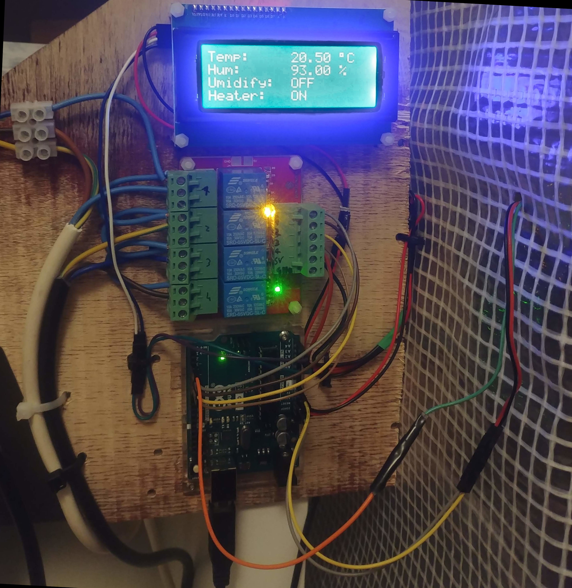

# ShroomIT
## Overview
ShroomIT is a simple automated mushroom growing project

## Components
* ArduinoUNO rev3
* DHT11 sensor 
* Jumper wires
* LCD display
* 4-channel Relay
* LEDs
* Ultrasonic atomiser
* Fan (optional: potentiometer)
* Heat source
* Hacked power strip

## Electronics

## Code

